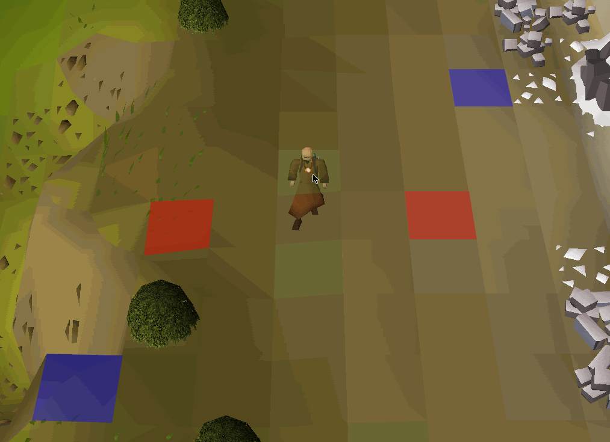

# Relative Tile Markers

**Relative Tile Markers** is a RuneLite plugin that allows you to highlight tiles based on your character’s current position, using directional offsets (e.g. `E2N1` for "2 east, 1 north").

Tiles are comma separated within sets, so in the example, the red tiles are defined as W2,E2. The blue tiles are W3S3,N3E3.

---

## Features

- Mark tiles relative to the player (e.g. `E3`, `N2W1`)
- Supports three independent marker sets (A, B, C)
- Custom settings for each set:
    - Tile inputs
    - Fill color and transparency
    - Outline color and thickness

---

## Use Cases
The main uses will be the various L methods, where a player moves an L shape away to avoid damage. Relative tiles should make this simpler.
For example:
- [Sol Heredit L method](https://www.youtube.com/watch?v=DUfBewpVk1s)
- [Whisperer](https://www.youtube.com/watch?v=TE8Szz5I_xs)
